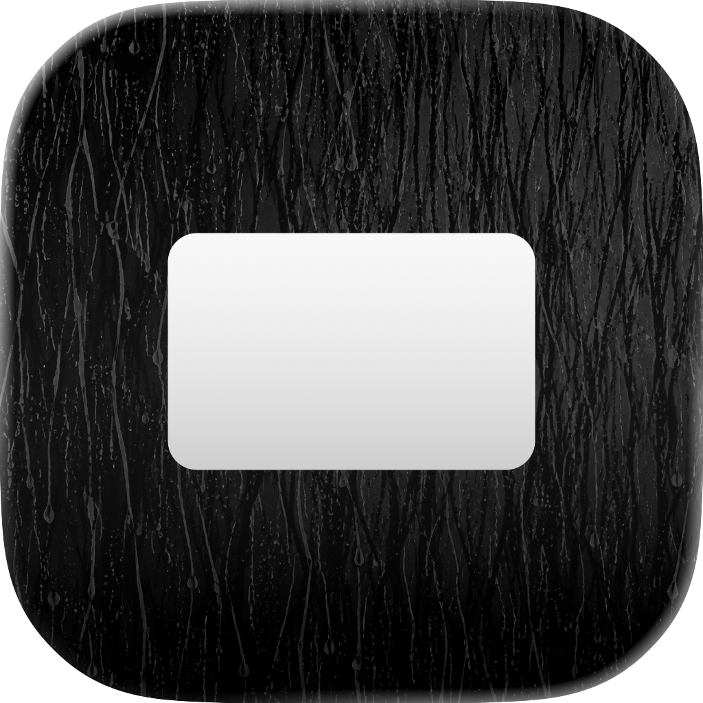
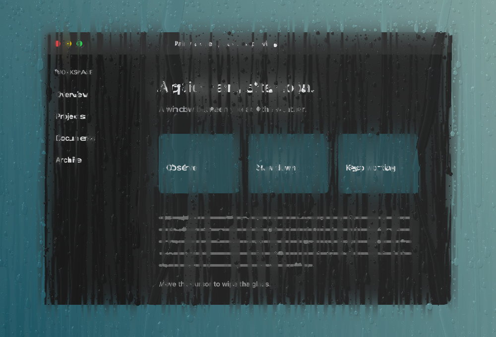
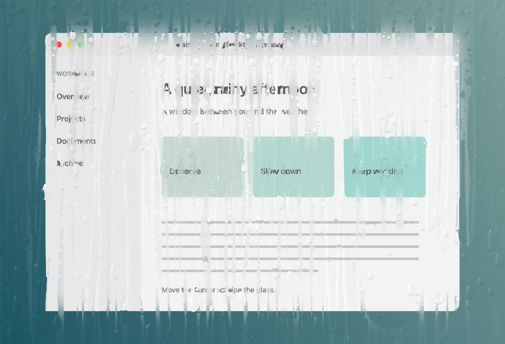
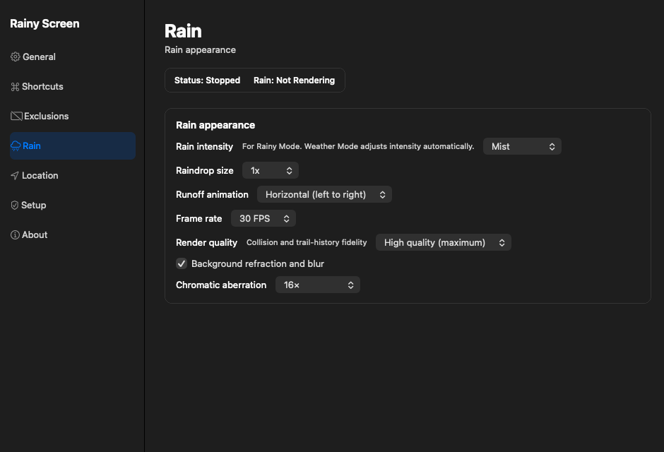
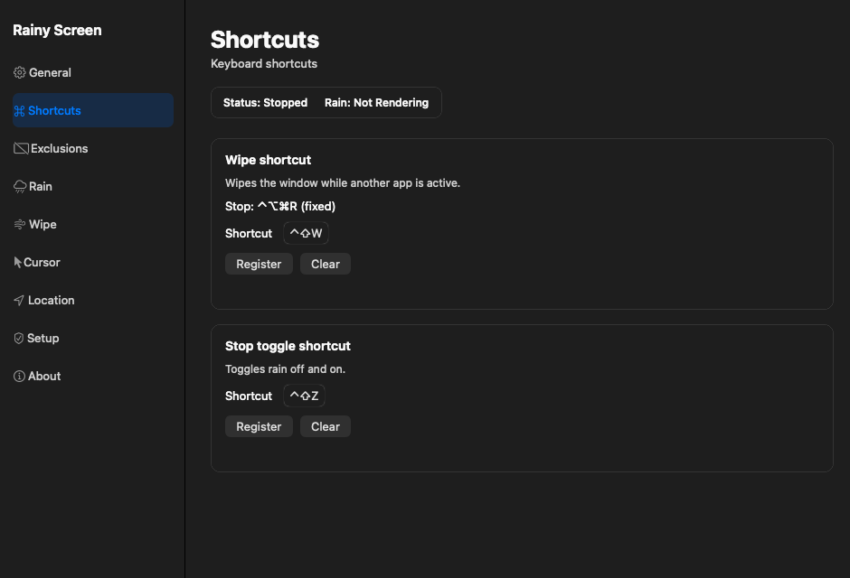

<div align="center">
  
  <h1>Rainy Screen</h1>
  <p>A quiet rain-on-glass atmosphere for your Mac desktop.</p>
  <p>
    
    
    
    
  </p>
  <p><a href="README.ja.md">日本語</a> · <a href="README.md">English</a></p>
</div>

<p align="center">
  
</p>

Rainy Screen is a macOS menu bar app that turns your connected displays into wet glass. Rain responds to the weather at your current or selected location, while droplets merge, pause, accelerate, form rivulets, and collect along a wipe edge before flowing away.

## Highlights

| | Feature |
| --- | --- |
| **Weather glass** | Follow local weather or switch to Rainy Mode for an always-raining desktop. |
| **Liquid motion** | Droplets vary in size and speed; water can merge into irregular through-flow rivulets. |
| **Wipe interaction** | Wipe the glass with the cursor or a configurable global shortcut. Horizontal and vertical wipe directions are available. |
| **Multi-display** | Apply the effect to every display or choose individual screens. |
| **Optical rendering** | Screen capture, refraction, blur, Fresnel reflection, and subtle chromatic aberration create the wet-glass look. |
| **Configurable load** | Choose 24/30/60 FPS and High / Balanced / Light render quality. |

<p align="center">
  
  
</p>

<p align="center"><i>Rain behavior and settings are still evolving during the early beta.</i></p>

## Setup

Build from source using the steps below, or download the latest early beta from [Releases](https://github.com/u2k8090/rainy-screen/releases). Prebuilt apps are ad-hoc signed and are not notarized. No Apple Developer membership is required for local source builds.

### Requirements

- Apple Silicon Mac
- macOS 14 Sonoma or later
- Xcode Command Line Tools
- Git

Install the Command Line Tools if needed:

```sh
xcode-select --install
```

### Build and run

```sh
git clone https://github.com/u2k8090/rainy-screen.git
cd rainy-screen
swift test -c release
./scripts/build.sh
open "dist/preview/Rainy Screen.app"
```

For the everyday-use build:

```sh
./scripts/build.sh --install
open "dist/Rainy Screen.app"
```

The build script creates the app bundle, converts the icon, and applies an ad-hoc signature. It does not install anything outside the repository.

## First launch

Rainy Screen can run without screen capture or location access, but some features depend on these permissions.

1. Open **Settings…** from the menu bar.
2. Choose **Rainy Mode** to try the glass effect without weather access.
3. Enable **Background refraction and blur** in the Rain settings if you want the desktop behind the glass to be visible through refraction.
4. Allow Rainy Screen in **System Settings → Privacy & Security → Screen Recording** when macOS asks.
5. Use **Weather Mode** and allow Location Services only if you want weather from your current location.

You can use a manually selected location instead of granting location access. Screen capture is processed in memory and is not saved or uploaded.

<p align="center">
  
</p>

## Controls

- **Weather Mode** — automatically adjusts rain intensity from Open-Meteo precipitation and weather codes. The manual rain-strength and random-cycle settings do not affect this mode.
- **Rainy Mode** — displays rain regardless of the weather.
- **Stop** — hides the overlays and stops rendering.
- **Stop toggle shortcut** — restores whichever mode was active before stopping.
- **Wipe shortcut** — clears the glass from another app using a registered modifier-key combination.
- **Cursor effects** — choose None, Wipe, or Blower. Wipe has five size levels from 0.5× to 2×. Blower sends nearby droplets and rivulets radially away from the cursor, with five strength levels that control impulse, travel distance, affected area, and fog clearing speed; after a finite travel distance, normal gravity and adhesion resume.
- **Rain strength** — from mist to downpour, with an optional random cycle, for Rainy Mode. Disabled in Weather Mode.
- **Wipe settings** — a dedicated Wipe category for horizontal/vertical direction and five speeds: 0.25×, 0.5×, 1× (original), 2×, and 4×. Settings are saved.
- **Render quality** — High, Balanced, or Light. Particle count stays the same; collision and trail work are reduced at lower levels.
- **Display selection** — target all displays or a saved subset.
- **Exclusions** — keep selected application windows clear.

The fixed stop shortcut is `Control + Option + Command + R`. Wipe and stop-toggle shortcuts can be registered in Settings → Shortcuts.

## Privacy and permissions

- **Screen Recording** is used only to sample the desktop for the refraction layer. Frames remain in memory.
- **Location Services** is used only for current-location weather. A manually selected place does not require it.
- **Accessibility and Input Monitoring** are not used. Cursor position is read through the app's event handling without injecting input.
- Weather data is requested from [Open-Meteo](https://open-meteo.com/). Coordinates are rounded before a current-location request.

Because local builds use ad-hoc signing, macOS may ask you to renew Screen Recording permission after rebuilding or replacing the app. Remove and re-add Rainy Screen in the Screen Recording list if the permission appears stuck.

## Development

Run the tests and local verification builds from the repository root:

```sh
swift test -c release
./scripts/build.sh

'dist/preview/Rainy Screen.app/Contents/MacOS/RainyScreen' --settings-state-test
'dist/preview/Rainy Screen.app/Contents/MacOS/RainyScreen' --settings-smoke-test
'dist/preview/Rainy Screen.app/Contents/MacOS/RainyScreen' --smoke-test --dark-preview
```

The smoke tests use a synthetic desktop and do not access the real screen or location. Settings screenshots are written to `artifacts/settings-preview/`; GPU previews are written to `artifacts/`.

The main modules are:

```text
RainCore              physics, weather intensity, droplets, merging, rivulets, wiping
RainRenderer          Metal pipeline, screen compositing, blur, optical effects
Rain.metal            height field, refraction, reflection, chromatic aberration
ScreenCapture         ScreenCaptureKit input with self-exclusion
WeatherService        Core Location and Open-Meteo integration
SettingsWindow        Settings UI and state synchronization
```

Public documentation is intentionally limited to this README and the screenshots in `docs/media/`. Internal design notes and development records are kept outside the public repository.

## Known limitations

- Apple Silicon only for now.
- macOS 14 or later is required.
- The public build is source-first and ad-hoc signed; there is no notarized binary yet.
- Core real-device checks have been reported by the maintainer. Weather, permissions, sleep/wake, login launch, and display reconnection can still vary across Mac configurations.
- The liquid model is a real-time approximation, not a full Navier–Stokes simulation or path-traced reconstruction.

## Contributing

Issues, visual feedback, and small reproducible test cases are welcome. When reporting a rendering issue, include:

- macOS version and Mac model
- display count and resolution
- rain strength and render quality
- whether refraction is enabled
- a screenshot or short screen recording when possible

Please keep changes focused and run `swift test -c release` before opening a pull request.

## License

Released under the [MIT License](LICENSE).
